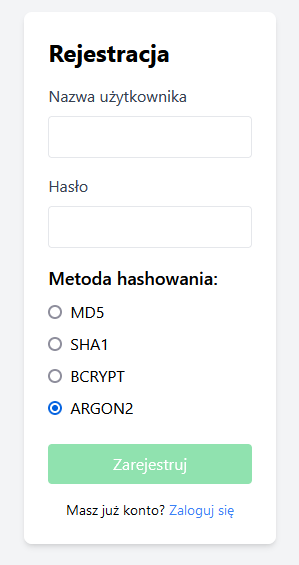
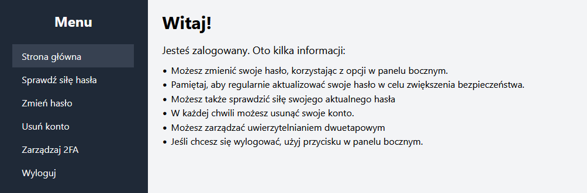
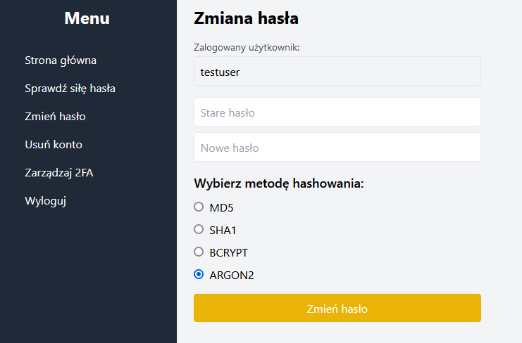
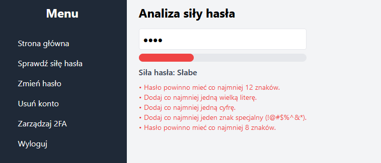
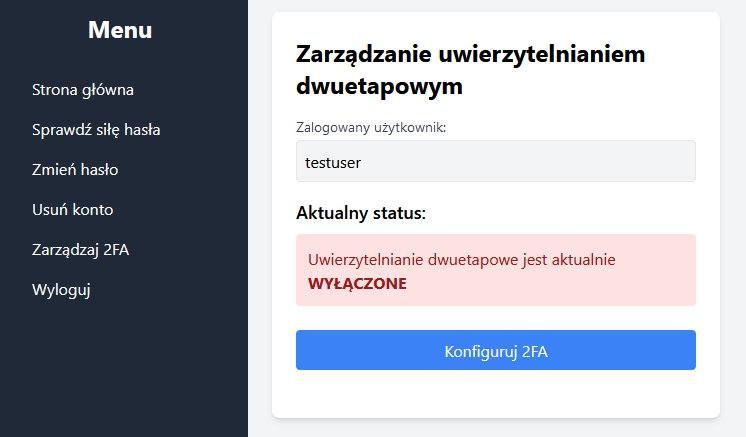

# 🛡️ PasswordApp - Secure Account Management Application

## 📦 Technologies

- **Backend:** Python, Django, Django REST Framework
- **Frontend:** JavaScript, React 
- **Database:** MySQL

---

## 🚀 Application Features

- User registration with a choice of password hashing method (`md5`, `sha1`, `bcrypt`, `argon2`)
- Login with account lock after multiple failed attempts
- Two-Factor Authentication (2FA) with QR code and TOTP support
- Password change and strength analysis
- Account deletion with confirmation
- Export user hashes (admin panel)
- Account and 2FA management panel

---

## 🔒 Security

> **The application is designed with user security in mind:**

- **Enforced password length:** minimum 12 characters
- **Advanced hashing methods:** support for `bcrypt` and `argon2`
- **Account lock:** after 3 failed login attempts, the account is locked for 30 minutes
- **Two-Factor Authentication (2FA):** option to enable/disable, QR code generation, TOTP verification
- **Session protection:** HTTPOnly cookies, CORS handling, CSRF protection
- **Password strength analysis:** detection of weak patterns, sequences, and repetitions
- **No plaintext password storage:** only hashes and salts
- **Hash export available only to admin** for security research and penetration testing simulations.

---

## 🔍 Educational Feature: Hash Export for Security Testing

The **admin** has the ability to export hashed passwords.  
This feature is intended **only for educational and security research purposes**, such as:

- **Simulating data breaches**
- **Analyzing password strength**
- **Testing hash cracking tools**, for example:
  - **Hashcat**
  - **John the Ripper**
- Using common wordlists like **rockyou.txt** during controlled experiments.

⚠️ **Important:** Use this feature only in a safe, controlled environment. Never expose real user data.

---

## 📝 Key Code Sections

- **`users/models.py`:** user logic, security methods, 2FA handling
- **`users/hashing.py`:** implementation of various hashing and password verification methods
- **`users/serializers.py`:** data validation, password strength enforcement
- **`frontend/src/components/PasswordStrength.js`:** client-side password strength analysis
- **`frontend/src/components/Manage2FA.js`:** configuration and management of 2FA
- **`backend/settings.py`:** session, CORS, and security configuration

---

## 🛠️ Installation

1. **Backend:**
    ```bash
    cd backend
    pip install -r requirements.txt
    python manage.py migrate
    python manage.py runserver
    ```

2. **Frontend:**
    ```bash
    cd frontend
    npm install
    npm start
    ```

---

## 👨‍💻 Usage

- Register and choose a hashing method
- Log in and configure 2FA (optional)
- Change password and check its strength
- Delete account or manage 2FA in the dashboard

---

## ⚠️ Security Notes

- **MD5 and SHA1 can be used for testing purposes only** – these are weak hashing methods and should never be used in production environments.
- For real-world security, always use **strong algorithms like `bcrypt` or `argon2`**.
- Choose **strong passwords** that include:
  - Uppercase and lowercase letters
  - Numbers
  - Special characters
- **Demo version:** not intended for production, no HTTPS, cookies are not Secure.
- **Passwords and secrets are never logged or stored in plain text.**
- **Hash export is for research only** – use responsibly in a controlled environment.
---

## 📸 Screenshots

### 📝 Register


### 🏠 Main Page


### 🔑 Update Password


### 📊 Password Strength


### 🔒 2FA Manage


## 📄 License

Educational project. You may use and modify for learning purposes.
